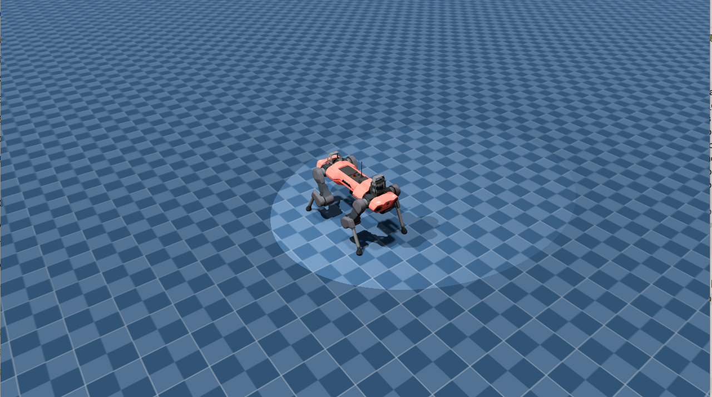

# 01 ANYmal C Minimal Environment

本阶段目标是在 MotrixLab 中搭建最小可运行的 ANYmal C 四足机器人环境。

该阶段主要用于理解 MotrixLab 自定义环境的基本组成，包括模型文件、环境配置、环境实现、环境注册、观测空间和动作空间。

## Runtime Environment

| Item             | Value                         |
| ---------------- | ----------------------------- |
| MotrixLab source | MotrixLab mainline            |
| Branch           | main / default                |
| Environment name | `anymal_c_navigation_minimal` |
| Purpose          | 学习自定义环境注册、模型加载、观测空间和动作空间      |

## Goal

本阶段完成以下内容：

* 引入 ANYmal C MJCF 模型；
* 创建 `navigation/anymal_c/` 自定义环境目录；
* 编写环境配置文件 `cfg.py`；
* 编写环境实现文件 `env.py`；
* 在 MotrixLab 中完成环境注册；
* 使用 `view.py` 成功加载 ANYmal C 模型；
* 验证 action space 和 observation space。

参考官方文档进行目录的搭建
[物理环境配置 — Motrixlab Documentation]( https://motrixlab.readthedocs.io/zh-cn/latest/user_guide/tutorial/physics_environment.html)

```text
motrix_envs/my_task/
├── __init__.py          # 模块初始化
├── cfg.py               # 环境配置
├── my_model.xml         # 物理模型文件
└── my_env.py            # 环境实现
```

## Directory Structure

本阶段在 MotrixLab 工作区中新增的核心目录如下：

```text
motrix_envs/src/motrix_envs/           
└── navigation/                       # 导航任务环境模块
    ├── __init__.py                   # 初始化文件
    └── anymal_c/                     # Anymal C 四足机器人导航环境
        ├── __init__.py               # 包初始化文件
        ├── cfg.py                    # 环境配置文件（基于 dataclass 的参数管理）
        ├── env.py                    # 环境主实现类，封装仿真交互逻辑
        └── xmls/                     # MJCF 模型文件目录
            ├── scene.xml             # 主场景描述文件（定义世界、光照、地面等）
            ├── anymal_c.xml          # Anymal C 机器人本体模型描述
            └── assets/               # 外部资源目录（存放网格、纹理等文件）    
```

## Model Assets

ANYmal C 模型使用 MJCF 格式文件。

模型资源来源：

```text
https://github.com/google-deepmind/mujoco_menagerie/tree/main/anybotics_anymal_c
```

使用方式：

1. 下载 `anybotics_anymal_c` 文件夹；
2. 将其放入 MotrixLab 工作区的以下路径：

```text
motrix_envs/src/motrix_envs/navigation/anymal_c/xmls/
```

完成后，目录应类似：

```text
xmls/
└── anybotics_anymal_c/
    ├── scene.xml
    ├── anymal_c.xml
    └── assets/
```

其中：

| File / Directory | Description      |
| ---------------- | ---------------- |
| `scene.xml`      | 主场景入口文件          |
| `anymal_c.xml`   | ANYmal C 机器人本体模型 |
| `assets/`        | 网格、纹理等外部资源       |

如果后续将模型资源上传到仓库，请保留原始来源和许可证说明。

## Environment Registration

MotrixLab 使用“导入模块触发注册”的方式管理环境。

为了让新增的 `navigation` 模块被识别，需要在 MotrixLab 的顶层环境包初始化文件中导入该模块。

原始形式通常为：

```python
from . import basic, locomotion, manipulation  # noqa: F401
```

修改为：

```python
from . import basic, locomotion, manipulation, navigation  # noqa: F401
```

同时，需要在 `navigation/` 和 `navigation/anymal_c/` 中完成环境注册相关导入。

本阶段涉及的核心文件包括：

```text
motrix_envs/src/motrix_envs/          # 项目环境包根路径
└── navigation/                       # 导航任务环境模块
    ├── __init__.py                   # 初始化文件
    └── anymal_c/                     # Anymal C 四足机器人导航环境
        ├── __init__.py               # 包初始化文件
        ├── cfg.py                    # 环境配置文件（基于 dataclass 的参数管理）
        └── env.py                    # 环境主实现类，封装仿真交互逻辑
```

## Space Definition

当前环境注册名：

```text
anymal_c_navigation_minimal
```

### Action Space

```text
Box(-1.0, 1.0, (12,), float32)
```

动作空间为 12 维连续动作空间，对应 ANYmal C 四条腿的 12 个位置控制执行器：

| Leg | Joints                       |
| --- | ---------------------------- |
| LF  | `LF_HAA`, `LF_HFE`, `LF_KFE` |
| RF  | `RF_HAA`, `RF_HFE`, `RF_KFE` |
| LH  | `LH_HAA`, `LH_HFE`, `LH_KFE` |
| RH  | `RH_HAA`, `RH_HFE`, `RH_KFE` |

### Observation Space

```text
Box(-inf, inf, (45,), float32)
```

观测空间为 45 维连续观测空间，组成如下：

| Index Range | Item                         | Dimension |
| ----------- | ---------------------------- | --------- |
| 0–2         | Base linear velocity         | 3         |
| 3–5         | Base angular velocity / gyro | 3         |
| 6–8         | Projected gravity            | 3         |
| 9–20        | Joint position error         | 12        |
| 21–32       | Joint velocity               | 12        |
| 33–44       | Last action                  | 12        |
| Total       |                              | 45        |

## Run

在 MotrixLab 工作区根目录下执行：

```bash
uv run scripts/view.py \
  --env anymal_c_navigation_minimal \
  --sim-backend np \
  --num-envs 1
```

## Result

本阶段完成后，ANYmal C 模型能够在 MotrixLab viewer 中正常加载，环境能够返回正确的 action space 和 observation space。

### Viewer Screenshot



### Demo Video
[ANYmal C Minimal Viewer Demo](results/anymal_c_minimal_viewer.mp4)


## Role in This Repository

该阶段是本仓库的第一个自定义环境实践阶段。

它不追求训练效果，而是用于确认以下基础能力：

* 是否能正确引入 MJCF 模型；
* 是否能在 MotrixLab 中注册自定义环境；
* 是否能通过 `view.py` 加载环境；
* 是否能定义稳定的 action space 和 observation space；
* 是否理解后续强化学习任务所需的最小工程结构。

该阶段为后续 `02_anymal_c_point_navigation` 和 `03_vbot_section01_navigation` 提供基础。
