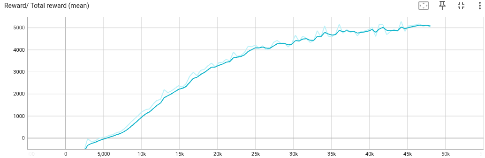

# 02 ANYmal C Point Navigation

本阶段在 `01_anymal_c_minimal` 的基础上，将 ANYmal C 最小环境扩展为寻点导航强化学习任务。

该阶段目标是跑通完整的 PPO 训练链路，包括目标点采样、速度命令生成、观测空间扩展、奖励函数设计、训练配置、TensorBoard 监控和策略推理。

## Runtime Environment

| Item             | Value                       |
| ---------------- | --------------------------- |
| MotrixLab source | MotrixLab mainline          |
| Branch           | main / default              |
| Environment name | `anymal_c_navigation_point` |
| RL config file   | `my_anymal_navigation.py`   |
| Purpose          | 跑通 ANYmal C 寻点导航 PPO 训练链路   |

## Goal

本阶段完成以下内容：

* 在 ANYmal C minimal 环境基础上新增寻点导航任务；
* 增加目标点采样逻辑；
* 根据目标方向生成速度命令；
* 扩展 observation space；
* 调整 action scale，使策略动作能产生有效步态；
* 设计寻点导航 reward；
* 使用 SKRL PPO 进行训练；
* 使用 TensorBoard 监控训练过程；
* 使用 `play.py` 加载 checkpoint 复现策略效果。

## Project Structure

本阶段在 MotrixLab 工作区中涉及的主要文件如下：

```text
MotrixLab/
├── motrix_envs/src/motrix_envs/navigation/anymal_c/
│   ├── cfg.py                  # 保留：上一阶段 minimal 环境配置
│   ├── env.py                  # 保留：上一阶段 minimal 环境实现
│   ├── cfg_point.py            # 新增：寻点导航环境配置
│   ├── env_point_np.py         # 新增：寻点导航环境实现
│   ├── __init__.py             # 修改：注册 minimal + point 两个环境
│   └── xmls/
│
└── motrix_rl/src/motrix_rl/tasks/
    ├── anymal_navigation.py    # 官方配置，不修改
    ├── my_anymal_navigation.py # 新增：自定义 PPO 配置
    └── __init__.py             # 修改：导入 my_anymal_navigation
```

## Environment Registration

本阶段注册的环境名称为：

```text
anymal_c_navigation_point
```

在 `motrix_envs/src/motrix_envs/navigation/anymal_c/__init__.py` 中，需要同时注册 minimal 和 point 两个环境。

在 `motrix_rl/src/motrix_rl/tasks/__init__.py` 中，只需要新增一行导入：

```python
from . import my_anymal_navigation  # noqa: F401
```

这样 `scripts/train.py` 和 `scripts/play.py` 才能通过环境名找到对应的 PPO 配置。

## Run

### Train

在 MotrixLab 工作区根目录下执行：

```bash
uv run scripts/train.py \
  --env anymal_c_navigation_point \
  --sim-backend np
```

### Play

加载训练得到的策略文件：

```bash
uv run scripts/play.py \
  --env anymal_c_navigation_point \
  --sim-backend np \
  --num-envs 4 \
  --rllib skrl \
  --policy <best_agent>
```

如果只想观察单个机器人，可以将 `--num-envs` 改为 `1`。

### TensorBoard

```bash
uv run tensorboard --logdir runs
```

## Environment Design

### Action Space

ANYmal C 使用 12 个主动关节，因此动作空间为：

```text
Action Space: Box(-1.0, 1.0, (12,), float32)
```

动作经过缩放后映射到关节位置控制目标：

```text
target_joint_angle = default_joint_angle + action * action_scale
```

动作对应 ANYmal C 四条腿的 12 个主动关节：

| Leg | Joints                       |
| --- | ---------------------------- |
| LF  | `LF_HAA`, `LF_HFE`, `LF_KFE` |
| RF  | `RF_HAA`, `RF_HFE`, `RF_KFE` |
| LH  | `LH_HAA`, `LH_HFE`, `LH_KFE` |
| RH  | `RH_HAA`, `RH_HFE`, `RH_KFE` |

训练过程中发现，早期 `action_scale = 0.06` 动作幅度偏小。即使策略输出接近饱和动作，机器人仍然几乎不移动。

后续逐步调整为：

```text
action_scale = 0.12
```

再进一步调整为：

```text
action_scale = 0.15
```

最终 `action_scale = 0.15` 能够产生更明显的腿部动作，同时没有明显导致机器人频繁翻倒。

### Observation Space

自定义寻点环境采用 54 维观测：

```text
Observation Space: Box(-inf, inf, (54,), float32)
```

观测结构如下：

| Item                 | Dimension |
| -------------------- | --------- |
| Base linear velocity | 3         |
| Base gyro / yaw rate | 3         |
| Projected gravity    | 3         |
| Joint position error | 12        |
| Joint velocity       | 12        |
| Last action          | 12        |
| Velocity command     | 3         |
| Position error       | 2         |
| Heading error        | 1         |
| Distance to target   | 1         |
| Reached flag         | 1         |
| Stop-ready flag      | 1         |
| Total                | 54        |

其中：

* `velocity_commands` 根据目标方向实时计算，表示机器人应该朝哪个方向运动；
* `position_error` 表示机器人当前位置与目标点之间的二维位置误差；
* `heading_error` 表示机器人朝向与目标方向之间的角度误差；
* `distance_to_target` 表示机器人到目标点的距离；
* `reached_flag` 表示是否已经到达目标；
* `stop_ready_flag` 用于辅助机器人在接近目标后减速停止。

### Target Sampling

早期版本中，目标点仅放在机器人前方近距离区域。后续逐步扩展为全方向目标采样。

最终采用极坐标采样：

```text
target_radius_min = 1.2
target_radius_max = 5.0
target_angle ∈ [-π, π]
```

也就是目标点在机器人周围全方向随机生成，距离范围约为 `1.2 m ~ 5.0 m`。

目标点位置计算方式为：

```text
target_offset = [
    target_radius * cos(target_angle),
    target_radius * sin(target_angle),
]

target_position = robot_init_position + target_offset
```

相比直接在方形区域内随机 `dx, dy`，极坐标采样更稳定，因为它可以避免过近目标，也能更清楚地控制目标距离分布。

### Target and Direction Visualization

为了便于调试，在 `scene.xml` 中加入了 3 个 mocap body：

```text
target_marker
robot_heading_arrow
desired_heading_arrow
```

它们分别用于显示：

| Marker                  | Purpose |
| ----------------------- | ------- |
| `target_marker`         | 当前目标点位置 |
| `robot_heading_arrow`   | 机器人当前朝向 |
| `desired_heading_arrow` | 期望前进方向  |

这一步对调试帮助较大。通过 viewer 可以直接检查：

* 目标点是否正常生成；
* 期望方向箭头是否指向目标；
* 机器人实际运动方向是否和期望方向一致。

## Simulation and Debugging

### Ground Name Mismatch

在自定义 `scene.xml` 中，地面 geom 名称为：

```xml
<geom name="floor" size="0 0 0.05" type="plane" material="groundplane"/>
```

最初配置中使用的是：

```text
ground_name = "ground"
```

这会导致接触检测无法正确找到地面。

后续改为：

```text
ground_name = "floor"
```

修改后，base contact 和 foot contact 的检测逻辑能够正确初始化。

### Sensor View Panic

早期尝试直接读取 XML 中的 sensor：

```text
base_linvel = "base_linvel"
base_gyro = "base_gyro"
```

运行时出现过 MotrixSim sensor view 相关 panic：

```text
cannot get given sensor's view
```

为避免环境在 sensor 缺失或 XML 不匹配时崩溃，最终在自定义环境中不强依赖 sensor，而是将配置设为空：

```text
base_linvel = ""
base_gyro = ""
```

并通过 base pose 差分估计线速度和 yaw rate：

```text
root_linvel = (root_pos - prev_root_pos) / ctrl_dt
yaw_rate = wrap_to_pi(root_yaw - prev_root_yaw) / ctrl_dt
```

这样可以保证环境在当前 XML 下稳定运行。

### Frequency Alignment

当前环境配置为：

```text
sim_dt = 0.01
ctrl_dt = 0.01
```

即仿真步长与控制步长一致，控制频率约为：

```text
1 / 0.01 = 100 Hz
```

这一设置保证 PPO 每次决策对应一个稳定的控制步长。

在当前阶段，先采用最简单的 `sim_dt = ctrl_dt`，避免引入 decimation 误差。后续如果需要更接近真实机器人控制频率，可以进一步采用：

```text
sim_dt × decimation = ctrl_dt
```

例如物理仿真 200 Hz、控制 50 Hz 的形式。

### Reset Shape Mismatch

训练到一定阶段后，出现过如下错误：

```text
ValueError: operands could not be broadcast together with shapes (255,) () (256,)
```

原因是部分环境 reset 时，并不是所有 `num_envs` 同时 reset，而是只 reset 已经 done 的子集，例如 255 个环境。

原 reward 和 termination 计算中，部分地方使用了固定的：

```python
self._num_envs
```

而当前 `data.shape[0]` 可能是局部 reset 数量，导致 shape 不一致。

解决方式是统一在 reward 和 termination 中使用：

```python
num_envs = data.shape[0]
```

并在 `base_linvel`、`base_gyro`、`current_actions`、`last_actions` 等变量 shape 不匹配时进行安全重置。

修改后训练可以继续运行，不再因为局部 reset 维度不一致而崩溃。

## PPO Training Configuration

本阶段主要使用 SKRL PPO 进行训练，配置文件为：

```text
motrix_rl/src/motrix_rl/tasks/my_anymal_navigation.py
```

最终采用接近官方基线但略轻量化的配置：

```python
self.num_envs = 1024
self.play_num_envs = 16

agent.rollouts = 48
agent.learning_epochs = 6
agent.mini_batches = 16
agent.learning_rate = 3e-4
agent.discount_factor = 0.99
agent.lam = 0.95
agent.grad_norm_clip = 1.0

agent.ratio_clip = 0.2
agent.value_clip = 0.2
agent.clip_predicted_values = True

trainer.timesteps = 48000
```

该配置虽然并行环境数是官方配置的一半，但保持了相同量级的 mini-batch size：

```text
1024 × 48 / 16 = 3072
```

这样可以在降低计算压力的同时，保持 PPO 更新时的 batch 结构与官方设置接近。

## Training and Debug Metrics

训练过程中在环境中加入 debug 输出，重点观察以下指标：

```text
distance_mean
distance_min
distance_max
base_linvel_xy_abs_mean
cmd_xy_abs_mean
action_abs_mean
reward_mean
terminated_ratio
```

### Early Training Issue

最初的环境版本中，策略可以输出动作，但机器人几乎不移动。

曾观察到：

```text
action_abs_mean = 1.0000
action_abs_max = 1.0000
base_linvel_xy_abs_mean ≈ 0
distance_mean 基本不变
```

这说明 policy 已经加载并输出动作，但由于动作尺度、奖励设计和目标课程过难，机器人没有形成有效步态。

之后通过以下方式改进：

* 增大 `action_scale`；
* 先使用前方近距离目标训练基础移动；
* 将目标速度命令改为“目标方向单位向量 × 限幅速度”；
* 增强 tracking velocity 和 approach reward；
* 降低 action penalty 和 action rate penalty；
* 增加防静止惩罚项。

### Improved Training Behavior

改进后，机器人开始明显朝目标移动。训练日志中出现过如下结果：

```text
[ANYmalC point debug] step=41500
  distance_mean=0.747
  distance_min=0.354
  distance_max=1.303
  base_linvel_xy_abs_mean=0.3053
  action_abs_mean=0.9221
  reward_mean=2.4823
  terminated_ratio=0.0000
```

随后：

```text
[ANYmalC point debug] step=42000
  distance_mean=0.297
  cmd_xy_abs_mean=0.0013
  base_linvel_xy_abs_mean=0.0093
  reward_mean=2.7645
  terminated_ratio=0.0000
```

这里 `distance_mean = 0.297` 已经小于当时的到达阈值，说明环境认为机器人已经接近目标。因此 `cmd_xy_abs_mean` 接近 0，机器人开始减速停止。

这说明训练开始产生有效的寻点行为。

## TensorBoard



## Policy Evaluation

训练完成后，需要显式指定 checkpoint 进行推理测试。

示例命令：

```bash
uv run scripts/play.py \
  --env anymal_c_navigation_point \
  --sim-backend np \
  --num-envs 1 \
  --rllib skrl \
  --policy <best_agent>
```

如果不显式指定 `--policy`，`play.py` 不一定会自动加载最新 checkpoint，可能出现机器人静止或策略未正确加载的问题。

## Troubleshooting

### Problem 1: Environment Runs but Robot Does Not Move

现象：

```text
action_abs_mean = 1.0000
action_abs_max = 1.0000
base_linvel_xy_abs_mean ≈ 0
distance_mean 不下降
```

分析：

这说明不是 policy 没有加载，也不是动作输出为 0，而是动作虽然饱和，但没有形成有效步态。主要原因是任务一开始太难，需要同时学习站稳、走路、转向、寻点和停止。

解决：

采用课程学习：

1. 先训练前方近距离目标；
2. 再扩展到全方向近中距离目标；
3. 最后扩大到全方向大范围目标。

同时调整：

* `action_scale`；
* 目标速度命令；
* reward 权重；
* 目标采样范围。

### Problem 2: Sensor View Panic

现象：

```text
cannot get given sensor's view
```

分析：

当前自定义 XML 中 sensor 配置和环境读取逻辑不完全匹配，直接调用 `get_sensor_value()` 可能触发底层 panic。

解决：

将 sensor 名称置空：

```text
base_linvel = ""
base_gyro = ""
```

并在环境中通过 pose 差分估计速度，避免强依赖 XML sensor。

### Problem 3: Target Point Is Not Visible

现象：

最初 viewer 中只能看到机器人，看不到目标点，也无法判断机器人应该往哪里走。

解决：

在 `scene.xml` 的 `<worldbody>` 中加入：

```text
target_marker
robot_heading_arrow
desired_heading_arrow
```

并在环境中通过 mocap body 更新它们的位置和朝向。

这样可以直观检查目标点、期望方向和实际运动方向。

### Problem 4: Local Reset Shape Mismatch

现象：

```text
ValueError: operands could not be broadcast together with shapes (255,) () (256,)
```

分析：

部分环境 done 后，MotrixLab 只 reset 子集环境，例如 255 个，而不是完整的 256 或 1024 个。如果 reward 中使用固定 `self._num_envs`，会和当前 `data.shape[0]` 不一致。

解决：

在 `_compute_reward()` 和 `_compute_terminated()` 中统一使用：

```python
num_envs = data.shape[0]
```

并对 `info` 中的数组进行 shape 检查，必要时重置为当前 batch 大小。

### Problem 5: Robot Is Still in Play

现象：

训练完成后直接运行 `play.py`，机器人仍然不动。

分析：

`play.py` 不一定自动加载最新 checkpoint，而且默认环境数较大。必须显式指定 policy 文件。

解决：

```bash
uv run scripts/play.py \
  --env anymal_c_navigation_point \
  --sim-backend np \
  --num-envs 1 \
  --rllib skrl \
  --policy <best_agent>
```

## Result

本阶段完成后，ANYmal C 能够在自定义 point navigation 环境中学习朝随机目标点移动。

虽然该阶段仍属于初学实验任务，策略效果还不是最终目标，但它完成了从“环境能加载”到“策略能训练并产生有效行为”的过渡。

## Role in This Repository

该阶段是连接 `01_anymal_c_minimal` 和 `03_vbot_section01_navigation` 的中间阶段。

它验证了以下能力：

* 自定义导航任务能被 MotrixLab 正确注册；
* PPO 配置能被自定义环境调用；
* 目标点、速度命令和奖励函数能形成有效训练信号；
* TensorBoard 和 debug 指标可以用于判断训练是否有效；
* 训练得到的 checkpoint 可以通过 `play.py` 进行策略复现。

该阶段为后续 VBot Section01 越障导航任务提供了强化学习训练链路上的基础经验。
