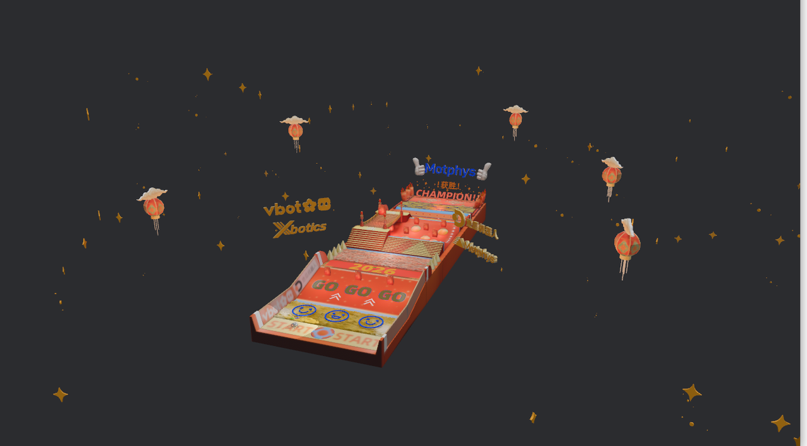
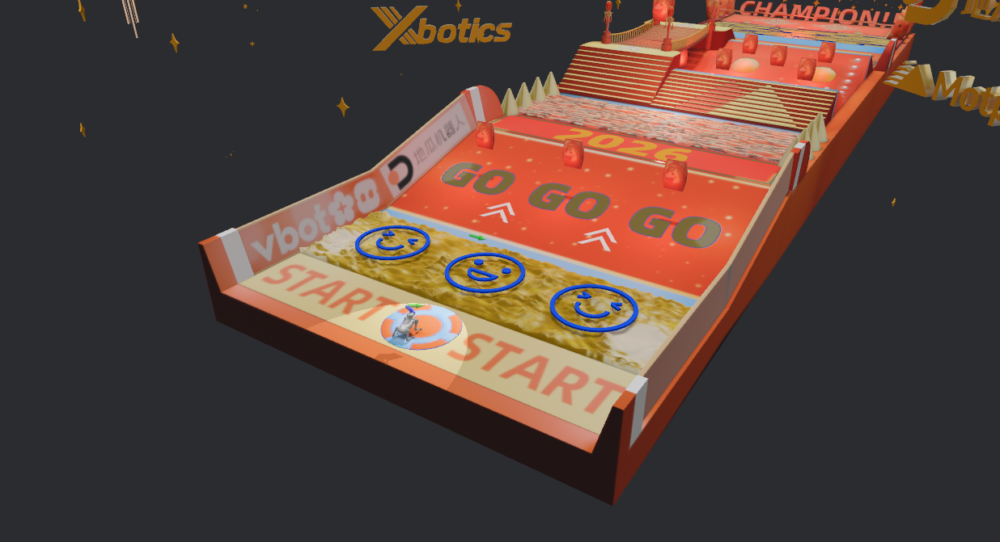
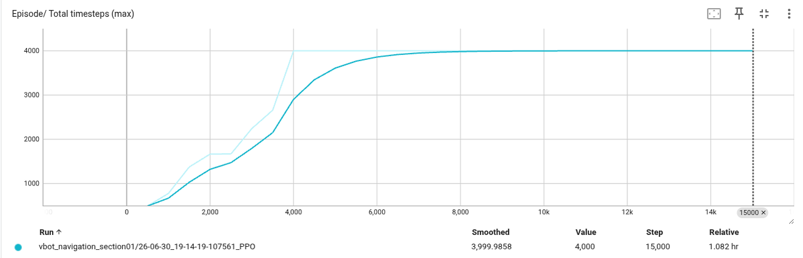
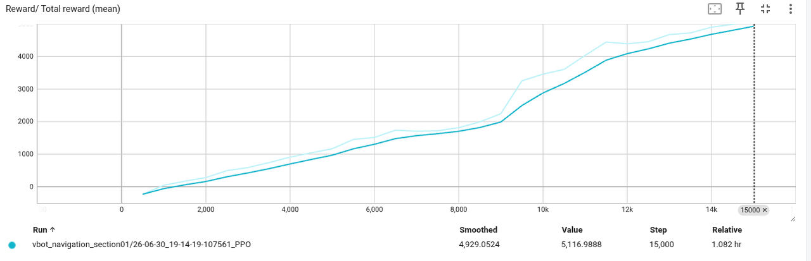

# 03 VBot Section01 Obstacle Navigation

本阶段是本仓库的综合实战项目。

目标是在 MotrixLab / MotrixSim 中训练 VBot 机器人完成 MotrixArena 越障导航赛段 Section01 第一阶段任务，并最终到达 2026 平台。

本阶段重点不是追求排行榜成绩，而是完成基础环境搭建、跑通强化学习训练流程、调试导航策略，并验证机器人能够实际完成赛段任务。

## Runtime Environment

| Item               | Value                           |
| ------------------ | ------------------------------- |
| MotrixLab source   | MotrixArena-S1 branch           |
| Branch             | `MotrixArena-S1`                |
| Environment name   | `vbot_navigation_section01`     |
| Simulation backend | `np`                            |
| Training backend   | `torch`                         |
| Purpose            | 完成 MotrixArena Section01 越障导航任务 |

## Goal

本阶段完成以下内容：

* 正确配置 VBot 机器人与 Section01 地形环境；
* 使用强化学习方法训练机器人完成越障导航；
* 让机器人通过崎岖区域、坡道衔接区域，并最终到达 2026 平台；
* 记录环境搭建、训练、调试、问题定位和最终验证过程；
* 保留关键代码、运行命令、训练配置和结果说明。

最终完成标准为：

```text
机器人能够走到 2026 平台，即视为完成越障导航赛段第一阶段。
```

## Setup

本阶段需要使用官方指定的 `MotrixArena-S1` 分支。

```bash
git clone --branch MotrixArena-S1 https://github.com/Motphys/MotrixLab.git
cd MotrixLab

uv sync --all-packages --all-extras
```

## Asset Deployment

本阶段依赖课程提供的 VBot 与 Section01 资产文件。

资产部署步骤：

1. 下载并解压更新资产：https://bcnsaumc3c7t.feishu.cn/wiki/NIQawzC2Ti11LEkAyKNcnc00nvd
2. 在以下路径中新建 `navigation/` 文件夹：

```text
MotrixLab/motrix_envs/src/motrix_envs/
```

5. 修改：

```text
MotrixLab/motrix_envs/src/motrix_envs/__init__.py
```

加入 `navigation` 模块：

```python
from . import basic, locomotion, manipulation, navigation  # noqa: F401
```

6. 创建：

```text
MotrixLab/motrix_envs/src/motrix_envs/navigation/__init__.py
```

内容为：

```python
from . import vbot  # noqa: F401
```

说明：

* 本仓库不包含完整课程资产；
* 本仓库只保存自定义代码、配置说明、运行命令和结果记录；
* 课程资产、官方 MotrixLab 源码和大型训练文件不随仓库分发。

## Project Structure

本阶段在 MotrixLab 工作区中主要涉及以下文件：

```text
MotrixLab/
├── motrix_envs/src/motrix_envs/navigation/vbot/
│   ├── __init__.py
│   ├── cfg.py
│   ├── vbot_section01_np.py
│   └── xmls/
│
└── motrix_rl/src/motrix_rl/
    └── cfgs.py
```

其中：

| File                   | Description                                           |
| ---------------------- | ----------------------------------------------------- |
| `cfg.py`               | 定义 VBot Section01 任务的环境配置、waypoint 路线、控制参数、奖励权重和传感器配置 |
| `vbot_section01_np.py` | 定义观测、动作、导航命令、奖励函数、终止条件和 reset 逻辑                      |
| `cfgs.py`              | 定义 PPO 训练参数，包括并行环境数量、rollout、网络结构、学习率和 checkpoint 间隔  |
| `__init__.py`          | 触发 VBot 环境注册                                          |

## Environment Name

本阶段注册的环境名称为：

```text
vbot_navigation_section01
```

## Run

### View Environment

查看任务环境：

```bash
uv run scripts/view.py --env vbot_navigation_section01
```



或者只启动单个环境：

```bash
uv run scripts/view.py \
  --env vbot_navigation_section01 \
  --num-envs 1
```



### Train

小规模调试训练：

```bash
uv run scripts/train.py \
  --env vbot_navigation_section01 \
  --num-envs 64 \
  --train-backend torch \
  --seed 42
```

正式训练：

```bash
uv run scripts/train.py \
  --env vbot_navigation_section01 \
  --num-envs 4096 \
  --train-backend torch \
  --seed 42
```

### Play

加载训练得到的 checkpoint 进行推理测试：

```bash
uv run scripts/play.py \
  --env vbot_navigation_section01 \
  --sim-backend np \
  --num-envs 1 \
  --policy runs/vbot_navigation_section01/<run_name>/checkpoints/best_agent.pt
```

### TensorBoard

```bash
uv run tensorboard --logdir runs --port 6006
```

## Task Design

### Navigation Strategy

本阶段采用 waypoint 分阶段导航方式，将 Section01 长距离越障任务拆解为多个中间目标点。

最终使用的 waypoint 路线为：

```text
(0.0, -0.60)
(0.0, 1.20)
(0.0, 2.25)
(-0.7, 3.8)
(-1.7, 5.8)
(-2.7, 8.0)
```

这样做的目的是降低直接追踪远距离目标的训练难度。

机器人先沿 Y 方向通过崎岖区域，再逐步向左上方平台移动，最终到达 2026 平台。

### Observation Space

本阶段观测维度为 68 维，主要包含：

| Item                  | Description |
| --------------------- | ----------- |
| Base linear velocity  | 机器人本体线速度    |
| Base angular velocity | 机器人本体角速度    |
| Projected gravity     | 投影重力        |
| Joint position        | 关节角度        |
| Joint velocity        | 关节速度        |
| Last action           | 上一步动作       |
| Velocity command      | 机体系速度命令     |
| Foot contact state    | 足端接触状态      |
| Terrain scan          | 前方地形扫描信息    |

观测空间：

```text
Observation Space: Box(-inf, inf, (68,), float32)
```

### Action Space

动作空间为 12 维连续动作空间，对应 VBot 四足机器人的 12 个主动关节。

```text
Action Space: Box(-1.0, 1.0, (12,), float32)
```

控制方式采用 PD 控制。策略输出动作后，动作被映射为目标关节位置，再由 PD 控制器计算关节力矩。

最终采用的控制参数为：

| Item           | Value  |
| -------------- | ------ |
| `action_scale` | `0.45` |
| `stiffness`    | `80.0` |
| `damping`      | `6.0`  |

## Velocity Command Design

机器人使用 waypoint 导航命令。

每一步根据当前机器人位置和当前 waypoint 计算目标方向，并生成机体坐标系下的速度命令：

```text
[vx_body, vy_body, yaw_rate]
```

为了避免机器人在复杂地形中速度过快导致摔倒，本阶段对不同地形区间设置了分段速度限制：

| Terrain Region | Strategy         |
| -------------- | ---------------- |
| Rough terrain  | 低速通过，但避免过慢       |
| Drop exit      | 降低速度，防止后腿跟不上     |
| Approach slope | 进一步限制前进速度，避免坡脚前栽 |
| Slope          | 保持低速持续上坡         |

最终使用的关键限速包括：

| Region           | Limit        |
| ---------------- | ------------ |
| `drop_exit`      | `vx <= 0.35` |
| `approach_slope` | `vx <= 0.38` |
| `slope`          | `vx <= 0.50` |

这组参数虽然不是最快策略，但能够提高通过崎岖区和坡脚衔接区的稳定性。

## Reward Design

奖励函数以“持续向目标前进”为主线，同时加入稳定性和防摔约束。

主要奖励项包括：

```text
tracking_lin_vel
tracking_ang_vel
tracking_goal_vel
tracking_yaw
forward_progress
target_progress
reach_goal
reach_all_goal
feet_air_time
anti_stall
```

关键奖励项说明：

| Reward              | Purpose                 |
| ------------------- | ----------------------- |
| `tracking_goal_vel` | 鼓励机器人朝目标方向移动            |
| `forward_progress`  | 鼓励机器人沿命令方向真实前进          |
| `target_progress`   | 鼓励机器人缩短与当前 waypoint 的距离 |
| `anti_stall`        | 惩罚有速度命令但身体速度不足的情况       |
| `reach_goal`        | 奖励机器人到达中间 waypoint      |
| `reach_all_goal`    | 奖励机器人到达最终目标             |

训练中还加入了以下辅助约束：

* 后腿防交叉；
* 后腿参与推进；
* 上坡前抗前栽；
* 坡脚处稳定性约束。

这些辅助项主要用于解决后腿绊腿、原地刷奖励和坡脚摔倒问题。

## Troubleshooting

### Problem 1: Reward Increases but Robot Does Not Progress

现象：

训练初期，机器人能够在崎岖区附近保持姿态或小幅摆腿，TensorBoard 中 reward 有上涨，但机器人没有持续向 waypoint 推进。

原因：

部分步态奖励和稳定性奖励可能让机器人学到“原地保持 + 小幅摆腿”的局部最优，而不是朝目标前进。

解决：

* 强化 `tracking_goal_vel`、`forward_progress` 和 `target_progress`；
* 加入 `anti_stall`，惩罚有命令但身体速度不足；
* 使用 waypoint 分阶段导航，避免直接追远距离目标；
* 简化复杂步态奖励，优先保证机器人真实前进。

### Problem 2: Invalid Quaternion during Reset

现象：

训练时出现类似报错：

```text
The dof pos at index 25 is invalid, it should be a normalized quaternion.
The dof pos at index 32 is invalid, it should be a normalized quaternion.
```

原因：

环境中除了机器人 base 外，还有可视化箭头等 freejoint body。之前错误地将默认关节角写入全局 `dof_pos` 的最后 12 位，导致 arrow body 的 quaternion 被关节角污染，从而触发 MotrixSim 的四元数合法性检查。

解决：

* 删除或注释掉直接写入全局 `dof_pos` 最后 12 位的逻辑；
* 使用 `_sanitize_freejoint_quaternions()` 修复 base 和 arrow freejoint 的 quaternion；
* 在 reset 中通过 `self._body.set_dof_pos(..., include_floatingbase=False)` 单独设置机器人关节角；
* 对 arrow body 的 quaternion 显式设置为合法单位四元数。

### Problem 3: Unstable Foot Contact Sensor Reading

现象：

直接读取部分 foot contact sensor 时，可能出现 sensor view 相关错误。

原因：

当前 MotrixSim 版本中，部分传感器名称或 sensor view 与预期不完全匹配，直接读取会导致底层异常。

解决：

* 使用 `_safe_get_sensor_value()` 包装传感器读取；
* 对读取失败的 sensor 做缓存，后续不重复触发异常；
* 将多个足端 sensor 聚合为每条腿的 contact 状态；
* 在观测中使用安全的足端 proxy 信息，保证训练链路稳定。

### Problem 4: Rear Legs Crossing

现象：

机器人能够开始前进，但两条后腿出现交叉，部分情况下后腿不主动参与运动，影响坡道稳定性。

原因：

原始奖励主要关注整体前进和目标跟踪，没有直接约束后腿左右髋关节的相对位置，也没有明确要求后腿参与推进。

解决：

* 加入 `rear_cross_penalty`，惩罚后腿髋关节过度靠近或交叉；
* 加入 `rear_hip_l2`，限制后髋大幅扫腿；
* 加入 `rear_drive_reward`，鼓励有移动命令时后腿参与运动；
* 保留较保守的后腿驱动权重，避免后腿通过原地抖动刷奖励。

### Problem 5: Falling before the Slope

现象：

机器人能够通过崎岖区，但在上坡前或坡脚附近容易前栽。

原因：

* 崎岖区出口速度过快；
* 前腿已经接近坡面，但后腿还没有跟上；
* 坡脚处姿态变化较大；
* 终止条件或速度命令过激会导致训练不稳定。

解决：

* 对 `drop_exit` 和 `approach_slope` 区域进行分段限速；
* 在上坡前加入 pitch penalty，减少前栽；
* 在坡道段加入 `slope_forward`，鼓励低速持续向前；
* 适当放宽终止条件，使机器人有机会在坡脚处恢复姿态。

## Final Training Configuration

### Environment

| Item                | Value                       |
| ------------------- | --------------------------- |
| Environment         | `vbot_navigation_section01` |
| Model file          | `scene_section01.xml`       |
| Simulation backend  | `np`                        |
| Training backend    | `torch`                     |
| Max episode seconds | `40.0`                      |
| Max episode steps   | `4000`                      |

### Control

| Item           | Value  |
| -------------- | ------ |
| `action_scale` | `0.45` |
| `stiffness`    | `80.0` |
| `damping`      | `6.0`  |

### PPO

| Item                        | Value             |
| --------------------------- | ----------------- |
| `num_envs`                  | `4096`            |
| `rollouts`                  | `48`              |
| `learning_epochs`           | `6`               |
| `mini_batches`              | `32`              |
| `learning_rate`             | `3e-4`            |
| `discount_factor`           | `0.99`            |
| `lambda_param`              | `0.95`            |
| `entropy_loss_scale`        | `0.0`             |
| `value_loss_scale`          | `2.0`             |
| `policy_hidden_layer_sizes` | `(512, 256, 128)` |
| `value_hidden_layer_sizes`  | `(512, 256, 128)` |
| `check_point_interval`      | `500`             |

## Results

最终训练得到的策略能够完成 MotrixArena 越障导航赛段 Section01 第一阶段。

推理测试中，机器人能够：

1. 从 Section01 起点出发；
2. 沿 waypoint 路线向前移动；
3. 通过崎岖区域；
4. 在坡脚前保持稳定；
5. 沿坡道继续前进；
6. 最终到达 2026 平台。

虽然最终动作仍存在一定小碎步和蠕动现象，但机器人能够完成本次任务要求的核心目标：走到 2026 平台。

因此，本阶段判定为完成。

### Key Observations


* 回合最大存活步数稳定升至 4000 步上限；
  

* reward 曲线随训练推进持续上升；

[VBot Section01 Success Demo](results/vbot_section01_success.mp4)
* 最终 checkpoint 能够在 `play.py` 中复现到达 2026 平台的行为；
* 训练中发现 reward 上升不一定代表任务真正完成，必须结合可视化推理结果判断策略是否有效。

## Summary

本阶段完整经历了：

* MotrixArena-S1 环境搭建；
* VBot Section01 资产部署；
* 训练脚本运行；
* waypoint 导航命令设计；
* 奖励函数设计；
* 传感器异常处理；
* 四元数 reset 问题修复；
* 后腿步态问题优化；
* 坡脚稳定性优化；
* 最终 checkpoint 推理验证。

最终结果表明，VBot 机器人能够完成越障导航赛段第一阶段，并成功到达 2026 平台。

该阶段进一步说明，在机器人强化学习任务中，reward 上升并不一定等价于任务完成。稳定性、阶段性调试、可解释的 reward 设计和及时保留成功 checkpoint，比单纯追求更高 reward 更重要。
